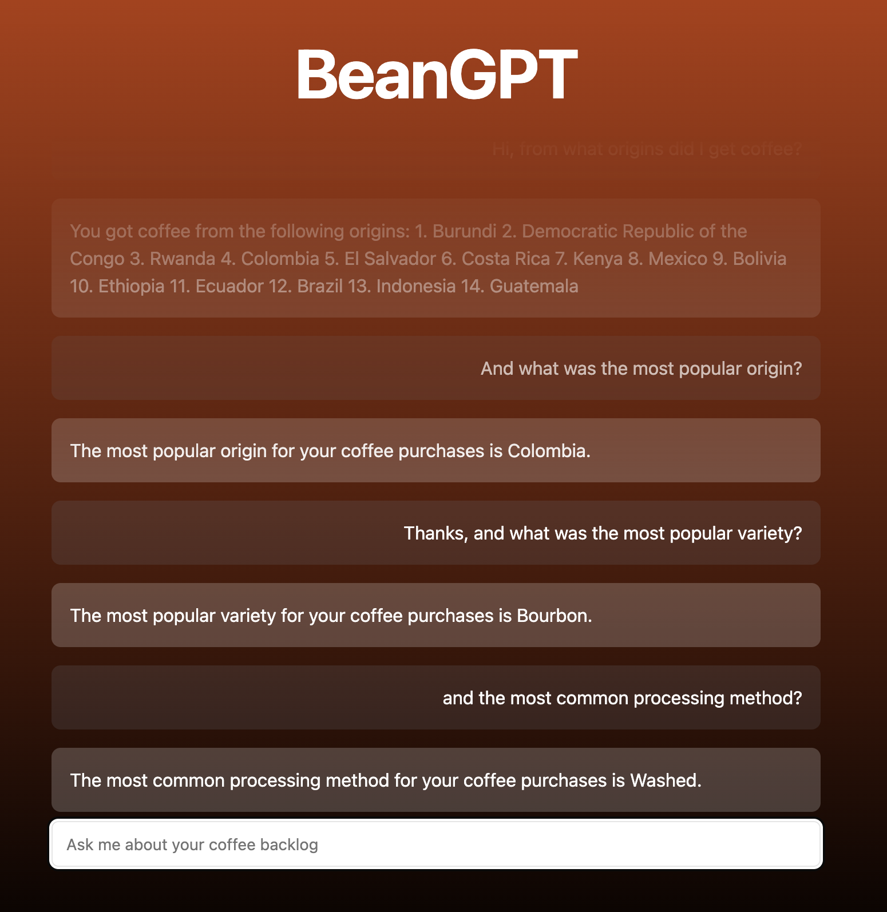
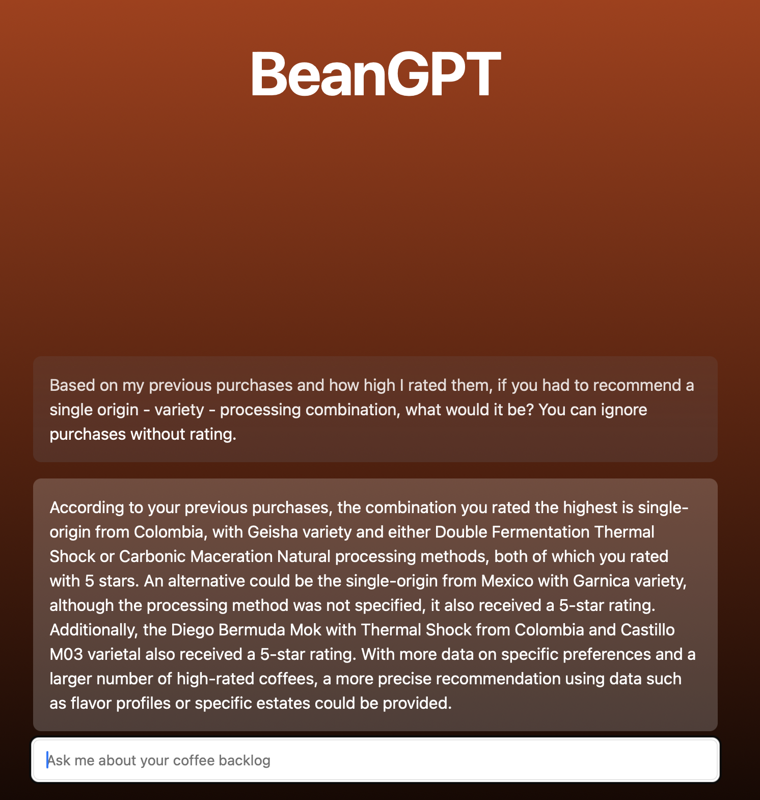
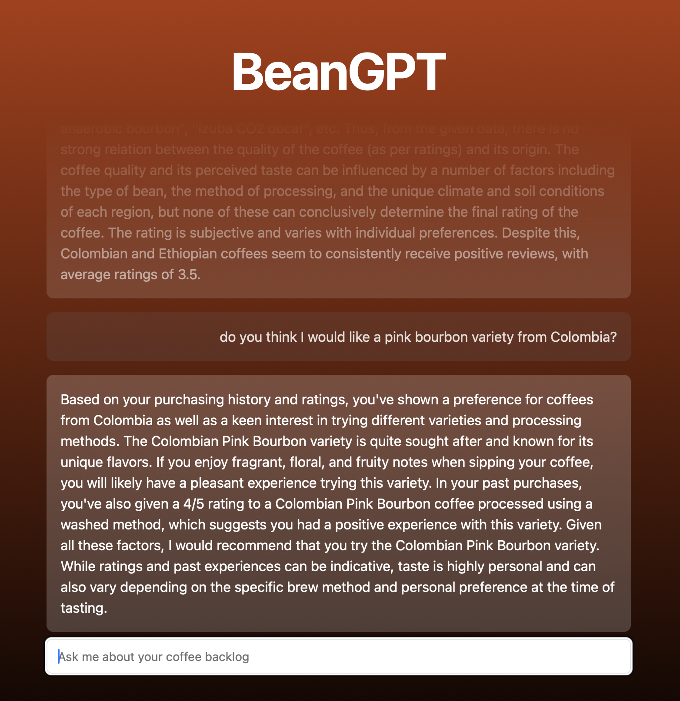

Had a couple of hours to spare and thought it might be fun to use OpenAI to keep track of my coffee purchases. 
I had never worked with the OpenAI API before, so this seemed like a fun project to spent 2-3 hours on.

## The data

I'm using Beanconqueror for the data. I already wrote the parsers for both Beanstats and my website, so it was very quick
to set up. Since the raw data is too much to process, I transferred the data into text and provided instructions to the OpenAI API.

An entry would look like this: `coffee: lord voldemort;3;200;16.2, bean information: colombia;wush wush;natural;huila;null;deiro garcia;null;`.

The values are: name, rating, weight, price, country, variety, processing, region, farm, farmer, elevation.

## The chat

After uploading a Beanconqueror zip file, BeanGPT will create two `system` messages to instruct the OpenAI API. The first message
contains the instruction where I explain the data, the second message is the coffee data. These messages are always sent to the API, but
the frontend filters these messages.

Any subsequent messages are sent as a `user` message, allowing me to chat with my coffee stats 😄☕️.

## The result







## The code

Project was set up using T3, using TypeScript and Tailwind. I also included Shadcn's component library.
The code can be found at my [Github page](https://github.com/marcelblijleven/beangpt).

The backend is fairly simple, a Next.js API route which sends the messages to OpenAI with the `stream` option set to true.
Vercel's AI SDK then converts the response to a `ReadableStream` using the `StreamingTextResponse` helper.

```typescript
import {OpenAIStream, StreamingTextResponse} from "ai";
import {type Messages, streamChat} from "~/lib/openai/stream";

export const runtime = "edge";

interface RequestWithJSON extends Request {
  json: () => Promise<{messages: Messages}>
}

export async function POST(req: RequestWithJSON) {
  const { messages } = await req.json();

  const res = await streamChat(messages);

  // Convert to stream and return
  const stream = OpenAIStream(res);
  return new StreamingTextResponse(stream);
}

```

The AI SDK provides a `useChat` hook which makes it easy to generate a chat interface in the frontend

```typescript jsx
"use client"

import {useChat} from "ai/react";
import {Input} from "~/components/ui/input";
import {ChatMessages} from "~/components/chat/messages";
import {useMessageStore} from "~/components/upload-form/store";

export default function Chat() {
  const initialMessages = useMessageStore(state => state.messages)
  const {messages, input, handleInputChange, handleSubmit} = useChat({
    initialMessages,
  })

  return (
    <div className={"mx-auto w-full max-w-2xl"}>
      <ChatMessages messages={messages} />
      <form onSubmit={handleSubmit}>
        <Input
          value={input}
          placeholder={"Ask me about your coffee backlog"}
          onChange={handleInputChange}
          className={"text-foreground"}
        />
      </form>
    </div>
  )
}

```

