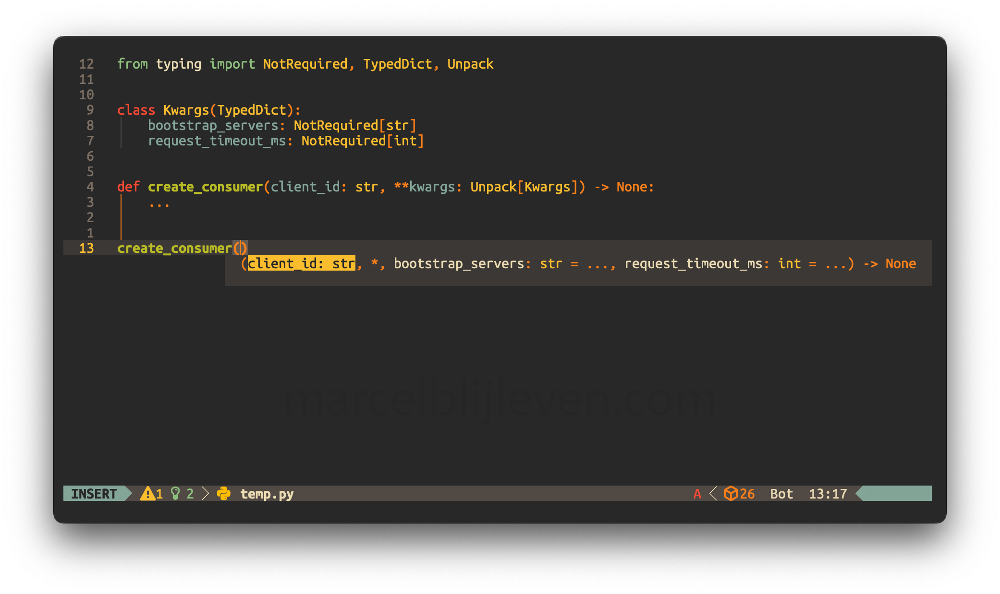

You've probably been using type annotations in Python for quite some
time now, but did you know you can also add them to `**kwargs`?

Technically it's been possible since Python 3.5, but it wasn't very useful.
You could simply add a regular type annotation to `**kwargs`, like so:

```python
def naive_approach(**kwargs: int) -> None:
    foo = kwargs.get("foo")  # foo is of type int | None

```

But this would mean that any value inside the kwargs dict is an int.

## TypedDict and Unpack

This is where `TypedDict` and `Unpack` can be helpful. These were introduced in 
Python 3.8 and Python 3.11 respectively, but `Unpack` was modified in 3.12 to support [PEP 692](https://peps.python.org/pep-0692/)
Both have also been made available in earlier versions through `typing_extensions`, but it's recommended to use at least version
3.11 because of [issues](https://github.com/python/typing_extensions/issues/103) in Python 3.10 and earlier versions.

A `TypedDict` lets you add type hints to dicts with a fixed set of keys. These keys can also be marked
as 'not required'.

`Unpack` conceptually marks a value as 'unpacked', combining this with a TypedDict lets you add meaningful type hinting to `**kwargs`.

```python
from typing import NotRequired, TypedDict, Unpack


class Kwargs(TypedDict):
    bootstrap_servers: NotRequired[str]
    request_timeout_ms: NotRequired[int]


def create_consumer(client_id: str, **kwargs: Unpack[Kwargs]) -> None:
    ...

```

This will give you code completion hints both inside the function body and when calling the function from
anywhere in your code.



This currently works in both (neo)vim and VSCode, it doesn't work in PyCharm as of this writing. There's an open ticket [here](https://youtrack.jetbrains.com/issue/PY-58406/Missing-python-type-check-error-pycharm-vs-pylance).

(P.S. don't mind the different color scheme in my editor :))


